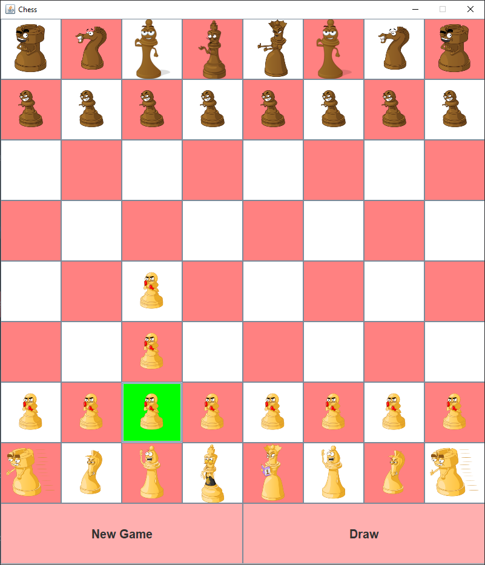

# myChessApp project

## Project purpose
### For real purpose

* Play chess 1 x 1 (without artificial intelligence)
* Example of a single Swing app

### For myself

* Reflection API
* Interfaces Implementation
* An attempt to abide by DRY and SOLID principles
* Practice with sound and pictures
* Threads
* Swing

## Project structure
* Apache Maven CheckStyle Plugin 3.1.1
* Java 9
* Swing
* Travis CI

## Available Functions

#### Choose Figure

* Show available steps 
### Draw
### Restart

## Future Available Functions

* Artificial intelligence

## Author

[Andrey Tanchak](https://www.linkedin.com/in/andrey-tanchak-8a1a141b1/)
